# Dead Line

## Team Members

List your team members here. Link to each member's individual github account.

| Member      | Github                        |
| ----------- | ----------------------------- |
| Stella Huo  | https://github.com/Stellahhh  |
| Hanbei Zhou | https://github.com/HanbeiZhou |
| Linda Fan   | https://github.com/yfan43     |

## Game Summary

A zombie-infection game where you will be a zombie or a human. If you are a zombie, try to infect more humans! If you are a human, try to avoid being infected!

## Genres

The broad category (or categories) your game will fall under. Examples include first-person shooter (FPS), real-time strategy (RTS), puzzle, rogue-like, etc.
**Our game category will fall under First-person Real-time strategy.**

## Inspiration

### [1. Cat-mouse game]

Cat-mouse game. An offline real-person game where players are assigned to a Cat or Mouse team. Cats need to catch the mouse and convert them to a cat. Every player will have a location tracker to display their location on the map.

### [2. PUBG]

In our game, since would be a time limit, we will implement a similar mechanic to PUBG’s shrinking play area. We plan that every 15 minutes, one-fifth of the game map will be shut down, which force both zombies and humans to leave the zone. Any player that remains in a restricted area will be eliminated instantly. One thing to note is that the shut down area will be reopened after 15 minutes. 

## Gameplay

**General rule:**
- A paragraph or bulleted list describing how the player will interact with the game, and the key gameplay mechanics that you plan to have implemented in your finalized game. Also use this section to broadly describe the expected user interface and game-controls.
- In this game, players (around 10 players) will be assigned to a map containing trees and obstacles randomly. 
- At the beginning of the game, every player will have 10 min to explore the map. 
- At the end of the 10 min, the players will be assigned to 2 teams: a Zombie team or a Human team, in a 1:9 ratio. (e.g., if the game consists of 30 players, there will be 3 players in the Zombie team and 47 in the Human team).
- Every player can access the map, which contains the rough location of every player as well as their identities.

**Zombie team**: 
- The zombies’ goal is to catch and infect humans by making contact with them.
- If the zombie team wins, two special recognitions are given:
1. the zombie who infected (contacted) the most human players
2. the zombie who caught the last human

**Human team**: 
- The humans’ goal is to survive and avoid being infected.
- Humans will join the Zombie team if they are contacted by the zombie.
- The human team wins if:
1. at least one human remains uninfected when the timer runs out (e.g., 30 minutes).
2. all zombies are eliminated before the timer expires.
- If all humans are infected, the last human to be infected is given the title "Final Prey."

**Movement**:

Users will move with their mouse and keyboard. 
- The user will use mouse movement to change perspective. (mouse moving left means looking towards the left)
- The user will use the keyboard (WASD) to move given the current perspective.
- The user will use the keyboard (space bar) to jump

**Special adjustment as the game progresses**:
- Zombies will have a hunger bar that will be filled in 15 min. As the zombies get more hungry, their moving speed increases. Catching a human will empty the hunger bar. If the hunger bar is filled, the zombie dies.
- Every 15 min, randomly ⅕ of the whole map will be temporally shut down. Players will have to get out of that area. There will be a warning 15 min prior to the shutdown.

**Win & lose conditions**: 

<b>Zombie Team Victory 🧟‍♂️</b>
- The zombie team wins when all humans are infected before the game ends.
    - The zombie that caught the most number of humans will be the <i><b>“Apex Predator”</b></i>.
    - The zombie that caught the last human will be the <i><b>“The Final Reaper”</b></i>.
    - The last human got infected will be the <i><b>“The Final Prey”</b></i>.

<b>Human Team Victory 🏃‍♂️</b>
- The human team  wins when all zombies are eliminated before the game ends.
- The human team 🏃‍♂️ also wins when at least one human survives until the timer expires. All remaining humans are <i><b>“The Hope”</b></i>.

<b>Game Draw Condition ⚔️</b>
- The game ends in a draw when all humans and all zombies are eliminated simultaneously (e.g. when they are all in shutdown zone)
  
## Development Plan

### Project Checkpoint 1-2: Basic Mechanics and Scripting (Ch 5-9)

Sketch out a rough idea of what parts of your game you will implement for the next submission, Project Checkpoint 1-2: Basic Mechanics and Scripting involving Unity textbook Chapters 5 through 9. You will come back to update this for each submission based on which things you've accomplished and which need to be prioritized next. This will help you practice thinking ahead as well as reflecting on the progress you've made throughout the semester.
- ~~Implement the map~~
  - Design the basic elements, such as trees, houses, water area, pit.
  - Design the random generation of the map
  - <b>According to the mentor's feedbacks, we implemented a fixed terrain for testing purposes</b>
- ~~Implement the 3D model for human and zombie~~
  - <b>According to the mentor's feedbacks, we used simple 3D prefabs to represent human and zombie.
- ~~Implement their movement~~
- ~~Implement keyboard association with movement~~
- ~~Implement collision detection~~
  - ~~Collision detection between player avatar and the environment objects~~
  - ~~Human & human collision and zombie-zombie collision~~
  - ~~Human & zombie collision~~
- ~~Implement death conditions~~
  - ~~How zombies die of hunger~~
  - ~~How both humans and zombies die due to being outside of the safe zone~~
- ~~Implement time limit~~
- ~~Implement win and lose condition~~
  - ~~Judge human wins or zombie wins~~
  - ~~Calculate zombie's infection number~~
  - ~~Determine the last survivor and last reaper~~
 
### Additions: 
- One significant addition to the project, which was not originally planned, was the implementation of <b>multiplayer functionality</b>. This feature is important for accurately testing win/loss conditions, ensuring that different scenarios, such as team eliminations and individual player outcomes, were handled correctly in a real-time environment.
- We also implemented how shutdown/warzone works and it was also not planned before

### Project Part 2: 3D Scenes and Models (Ch 3+4, 10)

we will first implement the tasks that we did not implement for Part 1: 
- ~~zombie moving speed increases as they get more hungry~~
- ~~render a 3D model of both zombie and human~~
- ~~render a 3D model for the scene/environment (include objects such as tree, house, rock, road, etc.)~~
    - ~~attach texture to it~~
- ~~implement random map generation~~
- ~~audio effect~~
  - ~~add the zombie sound when human was captured~~
- ~~smooth win/loose scene~~
- ~~implement user can jump~~
- ~~potentially add compass or mini map (2D)~~
- add HP (currently we have not implemented reduce life mechanism, so we will move this to next stage)
- ~~add invisible boundary? or high mountains at the map boundary to prevent users from falling~~
  - ~~add max and min for player position~~
- (feedback from previous assignment) add back button to re-start the game. (Currently not implementing it since it involves manipulation of the server state in Mirror multi-player system. We will keep working on it in the next checkpoint.)
- (feedback from previous assignment) add UI element such as timer. (Currently not implemented due to limited time -- we've created UI elements such as minimap as introduced below, and we will implement the timer in the next checkpoint.)
- (feedback from previous assignment) implementing zombie chasing function. (Not implemented, since the in real game the zombie are real player instead of AI, so the chasing function is not required.)

Addition:
- One significant addition is that we enabling multi-device, multi-player game, so that different computers connecting to the same WiFi can join the game. The game went smoothly with 4 players, and the server system could theortically hold 100 players.
- Another addition is that players can now randomly spawn at different locations.
- According to the feedback to the previous submission, we've hidden the cursor and the player could have to press 'C' to enable it.

### Project Part 3: Visual Effects
Since we are using a low-poly world, we don't need extensive visual effect to achieve a realistic and immersive feelings. We plan to add the following visual effects details to make the game more engaging, but our plan will focus on further developing our functionality.

Special effects:
- Add random weather conditions to increase the difficulty of the game
  - fog condition
  - raining condition
  - snowing condition
- Add blood to the player's sight if they are captured by the combie (blood particle)
- Add special effects for the relevant scene elements
  - Add the moving effect for water.
  - Add the smoke effect for the smoke emited by the train.
  - Add the fire effect for the fire in the camping land.
- Add different visual effect when player is human and when player is zombie (zombie's view can be covered by blood)

Further functionality implementation:
- Add the randomized "war zone" that will reduce the life amount for human.
- Add the return button (suggested by the previous feedback) so that the client can restart the game. 
- Attach to the win and lose scene to the specific condition of each player, so that different player will see different win/lose scenes.
- Randomly assigning a specific proportion of players to be born as zombie.

Further UI and rendering implementation:
- Add the HP bar for human and remaining time bar for zombie
- Add animation for the player movements

## Development

### Project Checkpoint 1-2: 

Describe the elements that you have coded so far for your game and how they work. Include screen captures and other figures.
1. <b>environment setup</b>
- implemented terrain with the unity default terrain and the terrain brushes
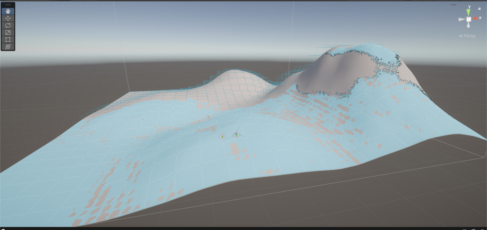

- created character prefabs for both humans and zombies
- movements associated with humans: move by WASD and can rotate the camera by moving the mouse. (Implemented by Input System)
2. <b>infection & collision</b>
- AI-zombies (for testing) will automatically chase humans when they are within a certain detection distance (Implemented by navigating mesh and tracking system)
- zombies colliding humans will turn humans into zombies
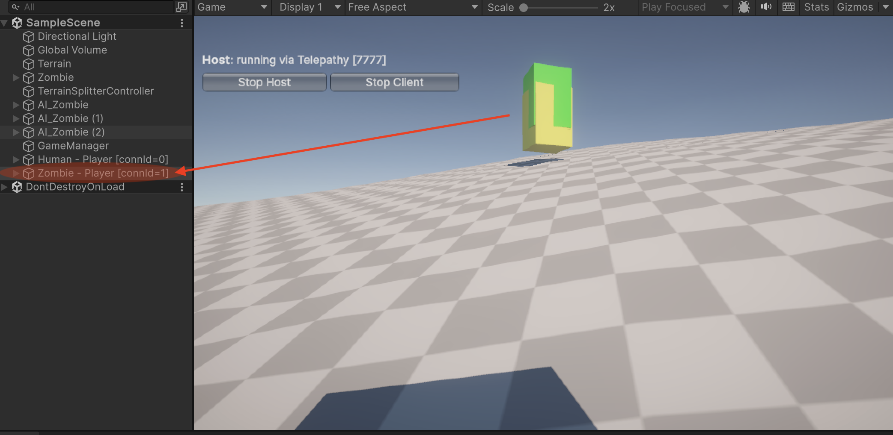

- tracking infection stats: the zombie controller and human controller keep track of the total number of humans infected by each zombie, the last zombie to infect a human (Final Reaper), and the last human to be infected (Final Prey)
3. <b>game management & win/lose conditions</b>
- Game manager object sets game durations and tracks win and lose conditions by constantly checking the number of humans/zombies
- when the game ends, players are taken to a Results Scene displaying the winner (and titles in case of zombies win)
- win and lose conditions implemented with a results scene and tested:

| Condition                                                       | Winner  | Message                                                  |
| --------------------------------------------------------------- | ------- | -------------------------------------------------------- |
| All humans turned to zombies **before** time runs out           | Zombies | **"Zombies win! All humans are infected"**               |
| All zombies eliminated due to hunger **before** time runs out   | Humans  | **"Humans win! You guys are the last hope"**             |
| Time runs out, but at least one human is alive                  | Humans  | **"Time's up! Humans win! You guys are the last hope!"** |
| Both humans and zombies are eliminated **before** time runs out | None    | **"It's a draw! Both sides have been eliminated..."**    |

screenshots for different conditions:
- Time out Human Win
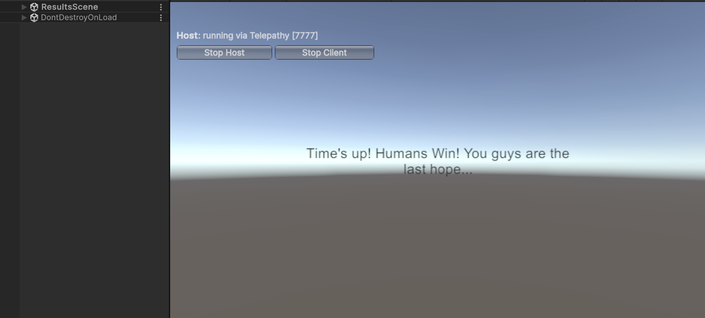

- Zombies Win before Timeout
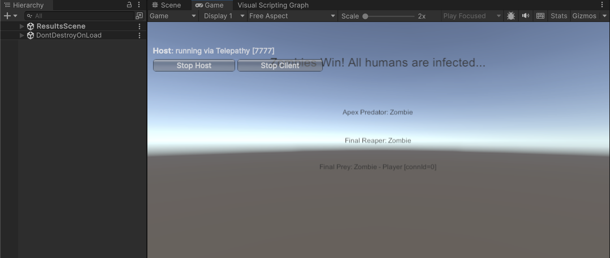

- Humans Win before Timeout
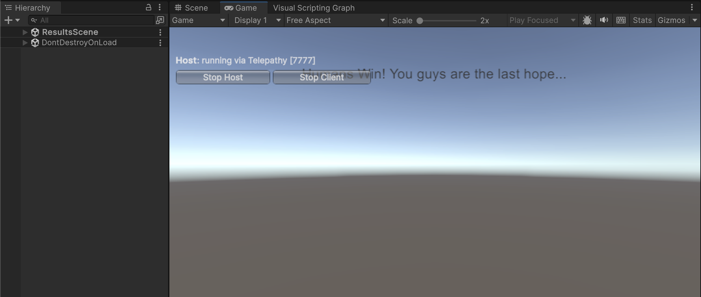

4. <b>Multiplayer implementation</b>

We used Mirror to implement the multi-user game, which will create a local server to host the game.

Steps to enable multiplayer functionality:
1. build and run the project
2. run the game in unity console, will see control panels on both screens
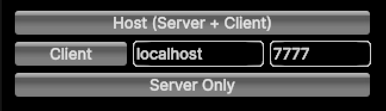

3. choose "host" for one, and "client" for the other
4. start playing the game! Each player will control their real character

5. <b>Adding NavMesh Surface to Newly Generated Terrain</b>

- Implemented terrain splitting:
    - The original terrain is split into four equal parts.
    - The original terrain is destroyed after splitting.
- After the new terrains are created, each of them automatically generates a new NavMesh Surface.
    - AI Zombies can navigate on these new terrains.
    - The NavMesh Surface is baked dynamically after splitting.

6. <b>AI Zombies Chase Humans When Close</b>

- Improved zombie AI behavior:
    - Previously, zombies only chased humans if they were within a specific distance.
    - Now, if a human enters a zombie’s detection range, zombies will immediately start chasing them.
- Implemented using NavMeshAgent and real-time tracking to ensure smooth chasing.

7. <b>Randomly Turning 1 of 4 Terrains Red & Destroying Characters</b>

Every 5 seconds, one random terrain turns red.
The remaining terrains turn green.
If any humans or zombies are inside the red terrain, they are destroyed instantly.
Implemented by checking X & Z coordinates of objects instead of using physics collisions.
This ensures a smooth destruction system without relying on colliders.

### Project Part 2: 3D Scenes and Models 

**Funcionality Improvement**

1. Map function
After pressing "M" on the keyboard, a map will appear showing the real-time top-down view of the area that's captured by a camera at the top.
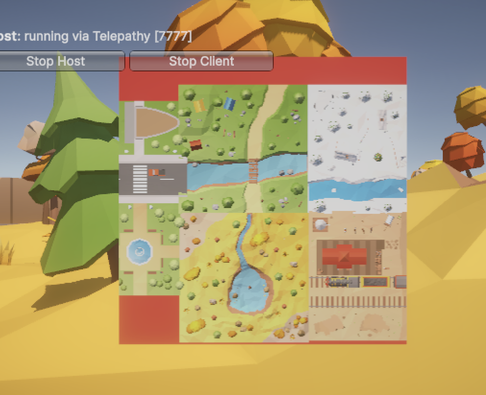

2. Jump function
The player can jump by pressing space bar. The player can at most jump twice.

3. Prefab switching function
The human prefab will become zombie prefab their rigid body detects a collision.
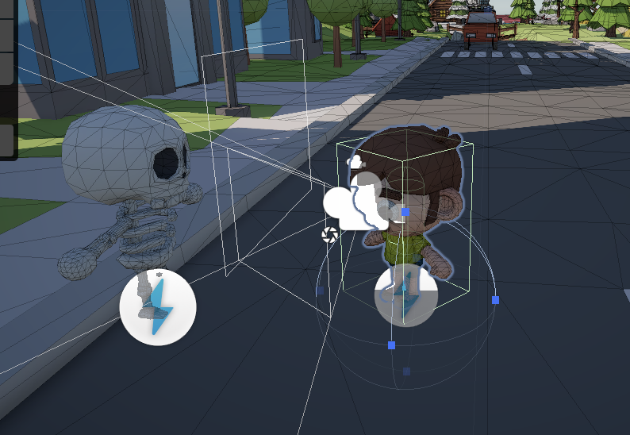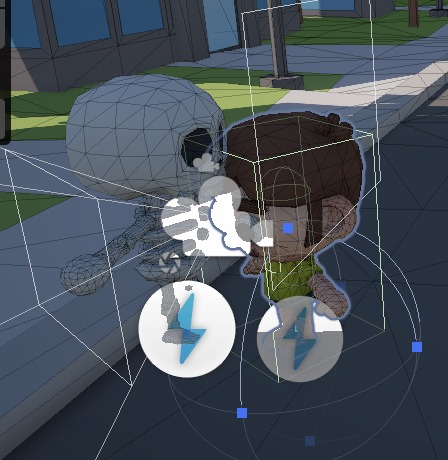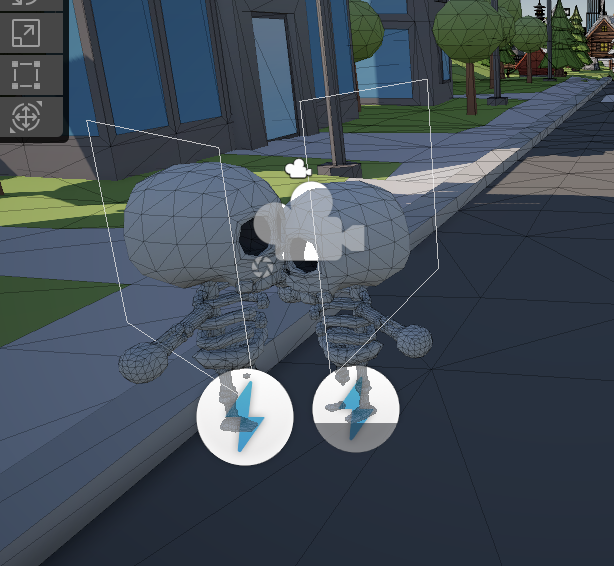

4. Terrain random generating function
The map will consist of 9 different themes, randomly selected from existing 10 themes. They will make up a 3x3 grid map to add more diversity and variability.
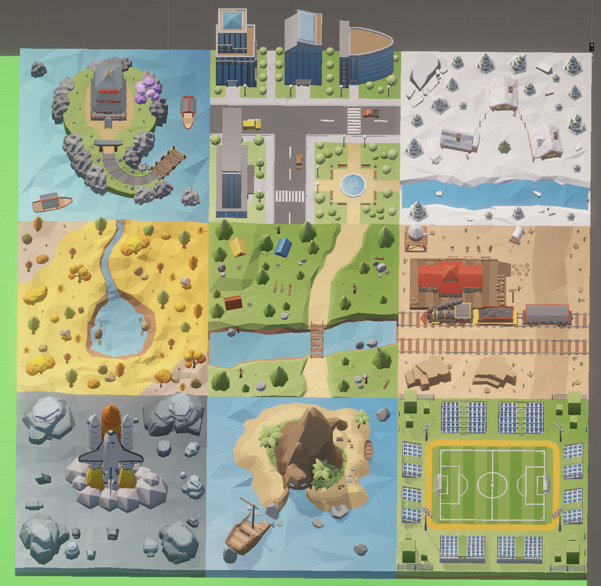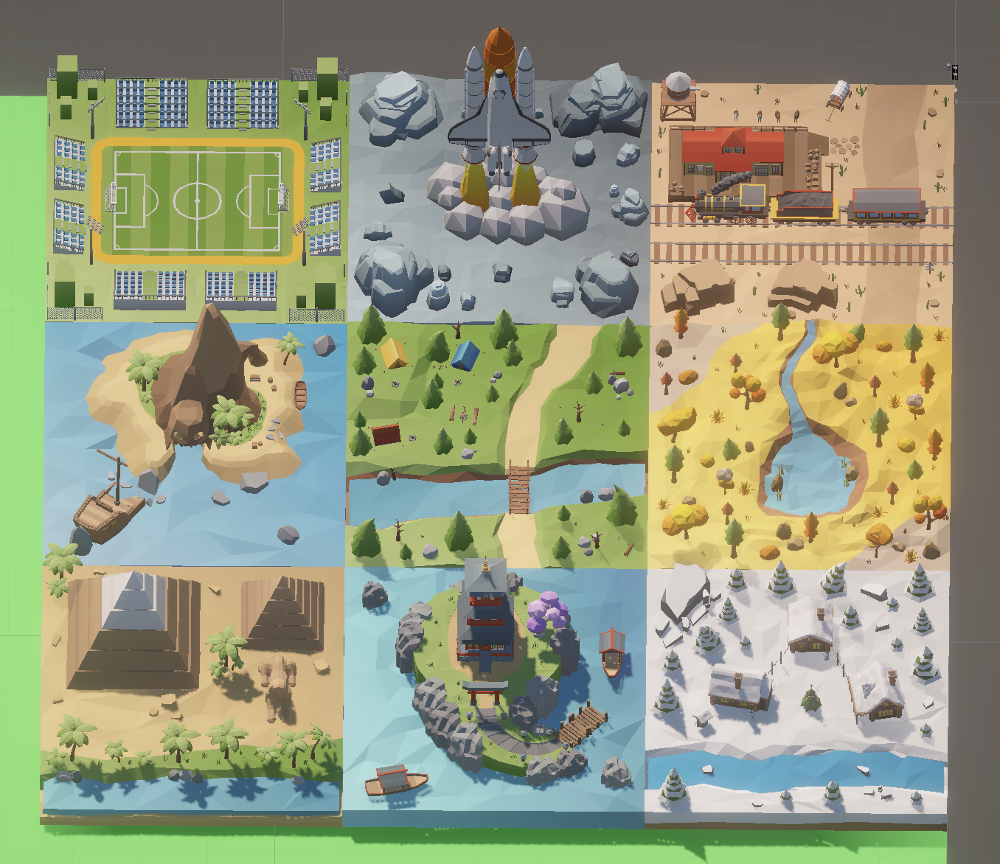

**3D model and rendering**

1. Created environment with (https://assetstore.unity.com/packages/3d/environments/landscapes/low-poly-atmospheric-locations-pack-278928)
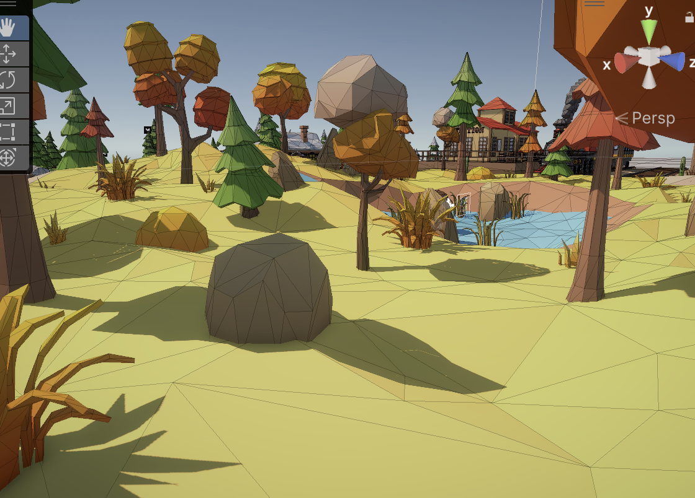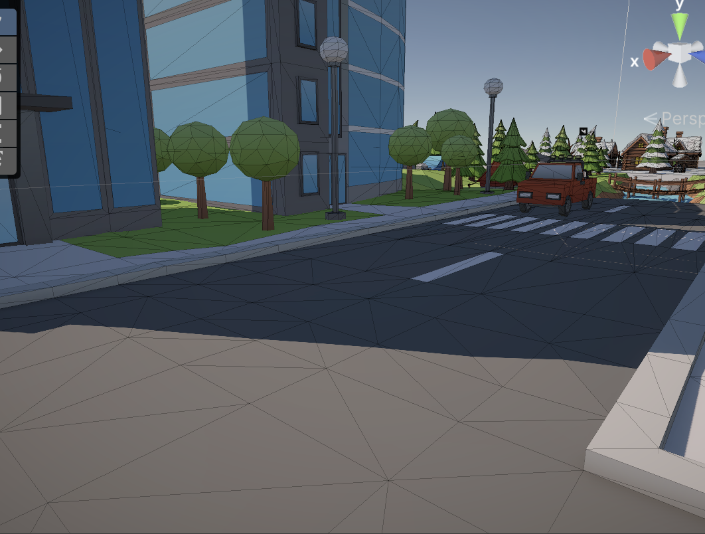
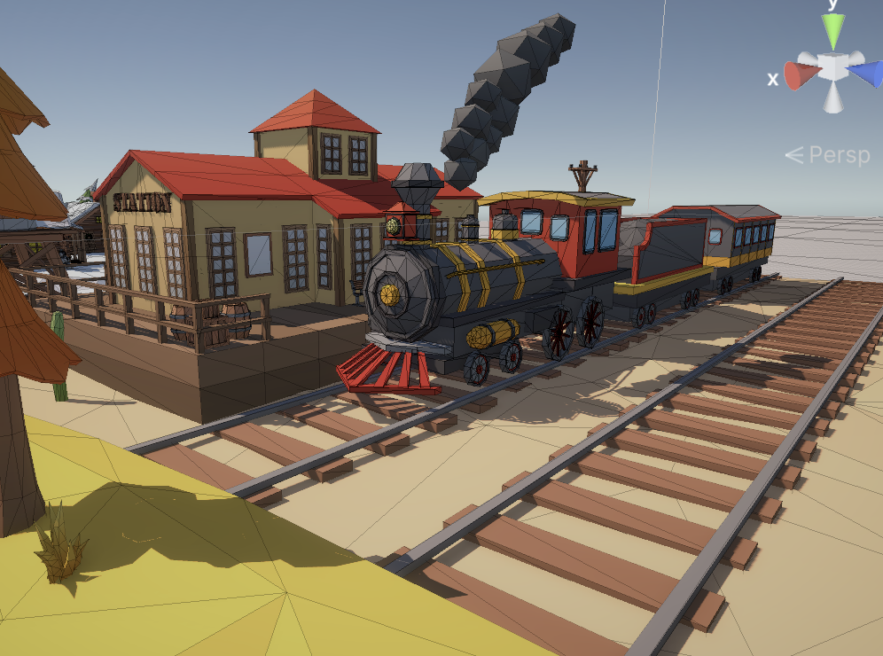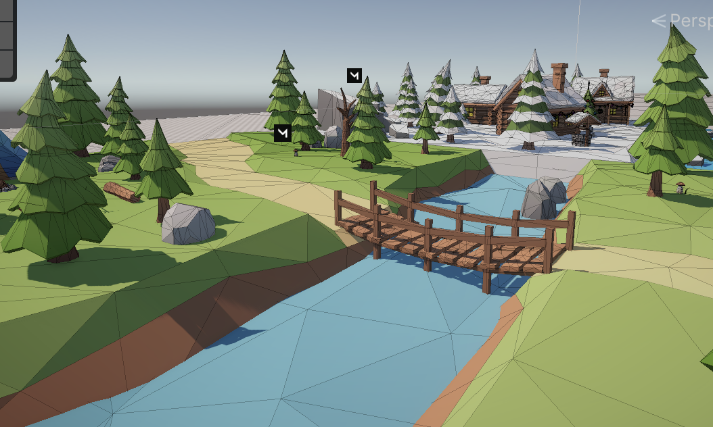

2. Created zombie prefab with (https://assetstore.unity.com/packages/3d/characters/humanoids/fantasy/mini-simple-characters-skeleton-free-demo-262897)
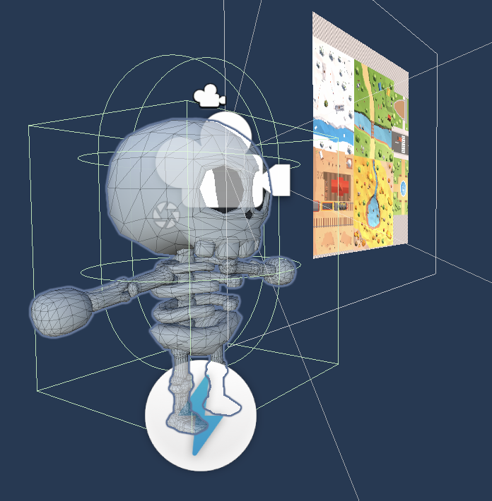
3. Created human prefab with (https://assetstore.unity.com/packages/3d/characters/humanoids/puppet-kid-free-demo-230773)

4. Added audio when zombie infected human with AudioClip downloaded from (https://sounddino.com/index.php?r=load&mp3&id=21841&l=2)

5. Win and lose scene
modified the win and lose scenes to make them more visually engaging.
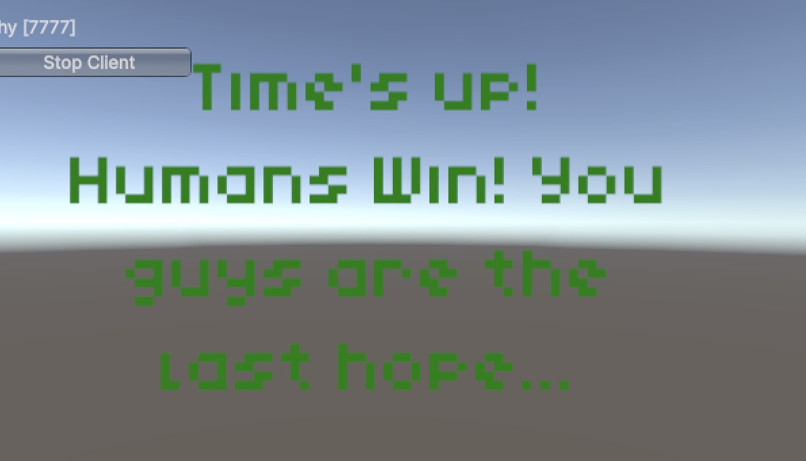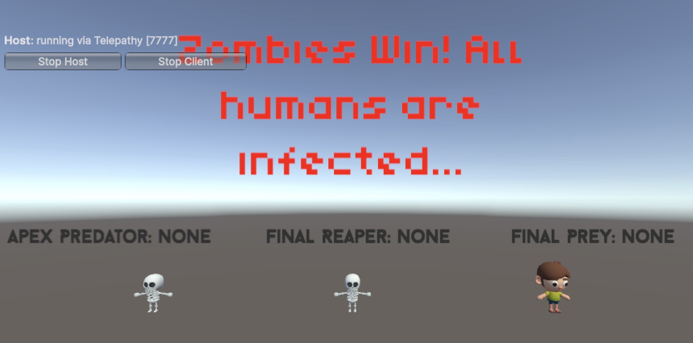

### Setup & Running the Game

1. Build and Run the Project
2. Run the Game in the Unity console and start the game in Unity’s Play mode. Control panels will appear on both screens.
3. Choose Multiplayer Roles: Select "Host" on one instance and "Client" on the other.
4. Start Playing! Each player controls a human character using the following controls:
- WASD → Move
- Mouse Movement → Change perspective

Testing Key Features

Zombie Interactions:
The game has a few zombies at certain locations, which may make them difficult to find. For easier testing, can manually drag a zombie prefab into the scene:
- Locate the prefab at:
Assets/Mini Simple Characters Skeleton Demo/Prefabs/Characters/mini simple skeleton demo.prefab
- Place it near a player to test collisions between humans and zombies.

Game Duration Customization:
- The game duration can be adjusted in the TrackWinOrLose script in Game Manager