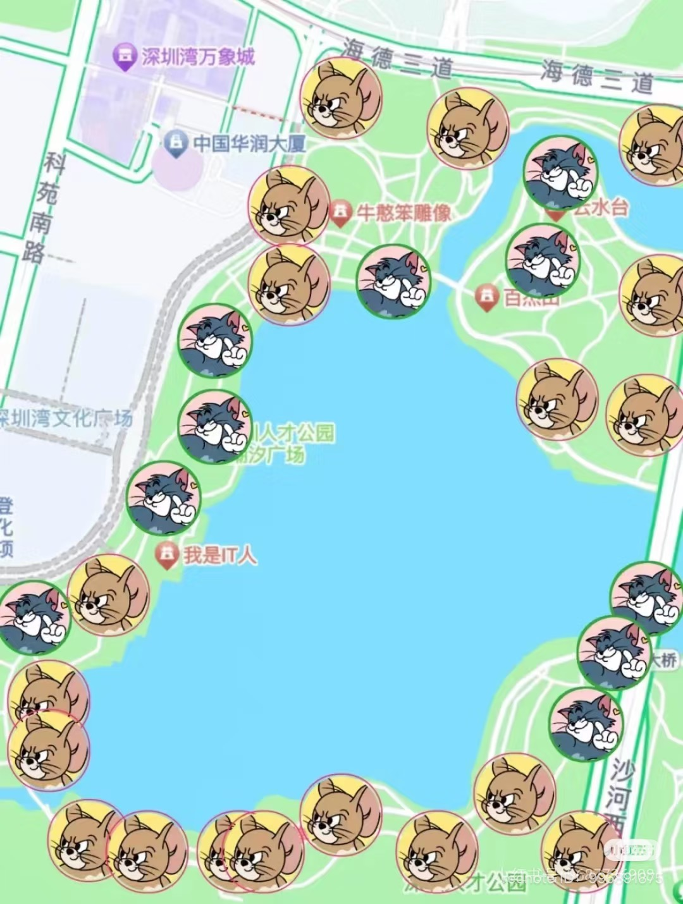
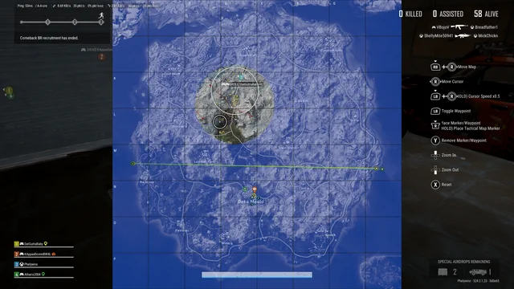

# Dead Line

## Team Members

List your team members here. Link to each member's individual github account.

| Member    | Github |
| -------- | ------- |
| Stella Huo  | https://github.com/Stellahhh    |
| Hanbei Zhou | https://github.com/HanbeiZhou     |
| Linda Fan    | https://github.com/yfan43    |

## Game Summary

A zombie-infection game where you will be a zombie or a human. If you are a zombie, try to infect more humans! If you are a human, try to avoid being infected!

## Genres

The broad category (or categories) your game will fall under. Examples include first-person shooter (FPS), real-time strategy (RTS), puzzle, rogue-like, etc.
**Our game category will fall under First-person Real-time strategy.**

## Inspiration

### [1. Cat-mouse game]

Cat-mouse game. An offline real-person game where players are assigned to a Cat or Mouse team. Cats need to catch the mouse and convert them to a cat. Every player will have a location tracker to display their location on the map.

### [2. PUBG]

In our game, since would be a time limit, we will implement a similar mechanic to PUBG’s shrinking play area. We plan that every 15 minutes, one-fifth of the game map will be shut down, which force both zombies and humans to leave the zone. Any player that remains in a restricted area will be eliminated instantly. One thing to note is that the shut down area will be reopened after 15 minutes. 

## Gameplay

**General rule:**
- A paragraph or bulleted list describing how the player will interact with the game, and the key gameplay mechanics that you plan to have implemented in your finalized game. Also use this section to broadly describe the expected user interface and game-controls.
- In this game, players (around 10 players) will be assigned to a map containing trees and obstacles randomly. 
- At the beginning of the game, every player will have 10 min to explore the map. 
- At the end of the 10 min, the players will be assigned to 2 teams: a Zombie team or a Human team, in a 1:9 ratio. (e.g., if the game consists of 30 players, there will be 3 players in the Zombie team and 47 in the Human team).
- Every player can access the map, which contains the rough location of every player as well as their identities.

**Zombie team**: 
- The zombies’ goal is to catch and infect humans by making contact with them.
- If the zombie team wins, two special recognitions are given:
1. the zombie who infected (contacted) the most human players
2. the zombie who caught the last human

**Human team**: 
- The humans’ goal is to survive and avoid being infected.
- Humans will join the Zombie team if they are contacted by the zombie.
- The human team wins if:
1. at least one human remains uninfected when the timer runs out (e.g., 30 minutes).
2. all zombies are eliminated before the timer expires.
- If all humans are infected, the last human to be infected is given the title "Final Prey."

**Movement**:

Users will move with their mouse and keyboard. 
- The user will use mouse movement to change perspective. (mouse moving left means looking towards the left)
- The user will use the keyboard (WASD) to move given the current perspective.
- The user will use the keyboard (space bar) to jump

**Special adjustment as the game progresses**:
- Zombies will have a hunger bar that will be filled in 15 min. As the zombies get more hungry, their moving speed increases. Catching a human will empty the hunger bar. If the hunger bar is filled, the zombie dies.
- Every 15 min, randomly ⅕ of the whole map will be temporally shut down. Players will have to get out of that area. There will be a warning 15 min prior to the shutdown.

**Win & lose conditions**: 

<b>Zombie Team Victory 🧟‍♂️</b>
- The zombie team wins when all humans are infected before the game ends.
    - The zombie that caught the most number of humans will be the <i><b>“Apex Predator”</b></i>.
    - The zombie that caught the last human will be the <i><b>“The Final Reaper”</b></i>.
    - The last human got infected will be the <i><b>“The Final Prey”</b></i>.

<b>Human Team Victory 🏃‍♂️</b>
- The human team  wins when all zombies are eliminated before the game ends.
- The human team 🏃‍♂️ also wins when at least one human survives until the timer expires. All remaining humans are <i><b>“The Hope”</b></i>.

<b>Game Draw Condition ⚔️</b>
- The game ends in a draw when all humans and all zombies are eliminated simultaneously (e.g. when they are all in shutdown zone)
  
## Development Plan

### Project Checkpoint 1-2: Basic Mechanics and Scripting (Ch 5-9)

Sketch out a rough idea of what parts of your game you will implement for the next submission, Project Checkpoint 1-2: Basic Mechanics and Scripting involving Unity textbook Chapters 5 through 9. You will come back to update this for each submission based on which things you've accomplished and which need to be prioritized next. This will help you practice thinking ahead as well as reflecting on the progress you've made throughout the semester.
- ~~Implement the map~~
  - Design the basic elements, such as trees, houses, water area, pit.
  - Design the random generation of the map
  - <b>We did not implement random generation, instead we implemented a fixed terrain for testing purposes</b>
- ~~Implement the 3D model for human and zombie~~
- ~~Implement their movement~~
- ~~Implement keyboard association with movement~~
- Implement collision detection
  - Collision detection between player avatar and the environment objects
  - Human & human collision and zombie-zombie collision
  - ~~Human & zombie collision~~
- Implement death conditions
  - ~~How zombies die of hunger~~
  - How both humans and zombies die due to being outside of the safe zone
- ~~Implement time limit~~
- Implement win and lose condition
  - ~~Judge human wins or zombie wins~~
  - Calculate zombie's infection number
  - Determine the last survivor and last reaper
 
### Additions: 
- One significant addition to the project, which was not originally planned, was the implementation of <b>multiplayer functionality</b>. This feature is important for accurately testing win/loss conditions, ensuring that different scenarios, such as team eliminations and individual player outcomes, were handled correctly in a real-time environment.
- We also implemented how shutdown/warzone works and it was also not planned before

### Project Part 2: 3D Scenes and Models (Ch 3+4, 10)

we will first implement the tasks that we did not implement for Part 1: 
- implement basic elements in the map
- implement random map generation
- Collision between player/zombie and environment objects
- Human/human and zombie/zombie collision
- zombie moving speed increases as they get more hungry

## Development

### Project Checkpoint 1-2: 

Describe the elements that you have coded so far for your game and how they work. Include screen captures and other figures.
- win and lose conditions implemented with a results scene and tested:

| Condition | Winner | Message |
| --------- | ------- | ------- |
| All humans turned to zombies **before** time runs out | Zombies | **"Zombies win! All humans are infected"** |
| All zombies eliminated due to hunger **before** time runs out | Humans | **"Humans win! You guys are the last hope"** |
| Time runs out, but at least one human is alive | Humans | **"Time's up! Humans win! You guys are the last hope!"** |
| Both humans and zombies are eliminated **before** time runs out | None | **"It's a draw! Both sides have been eliminated..."** |
- 

