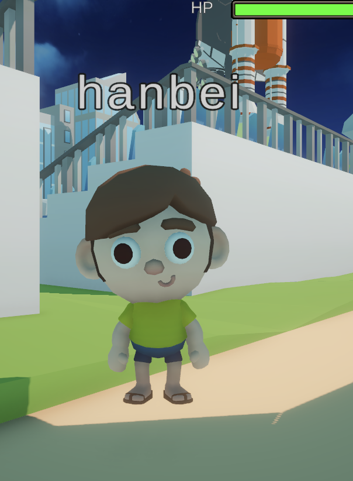

# Dead Line

## Team Members

List your team members here. Link to each member's individual github account.

| Member      | Github                        |
| ----------- | ----------------------------- |
| Stella Huo  | https://github.com/Stellahhh  |
| Hanbei Zhou | https://github.com/HanbeiZhou |
| Linda Fan   | https://github.com/yfan43     |

## Game Summary

A zombie-infection game where you will be a zombie or a human. If you are a zombie, try to infect more humans! If you are a human, try to avoid being infected!

## Genres

The broad category (or categories) your game will fall under. Examples include first-person shooter (FPS), real-time strategy (RTS), puzzle, rogue-like, etc.
**Our game category will fall under First-person Real-time strategy.**

## Inspiration

### [1. Cat-mouse game]

Cat-mouse game. An offline real-person game where players are assigned to a Cat or Mouse team. Cats need to catch the mouse and convert them to a cat. Every player will have a location tracker to display their location on the map.

### [2. PUBG]

In our game, since would be a time limit, we will implement a similar mechanic to PUBG’s shrinking play area. We plan that every 15 minutes, one-fifth of the game map will be shut down, which force both zombies and humans to leave the zone. Any player that remains in a restricted area will be eliminated instantly. One thing to note is that the shut down area will be reopened after 15 minutes. 

## Gameplay

**General rule:**
- A paragraph or bulleted list describing how the player will interact with the game, and the key gameplay mechanics that you plan to have implemented in your finalized game. Also use this section to broadly describe the expected user interface and game-controls.
- In this game, players (around 10 players) will be assigned to a map containing trees and obstacles randomly. 
- At the beginning of the game, every player will have 10 min to explore the map. 
- At the end of the 10 min, the players will be assigned to 2 teams: a Zombie team or a Human team, in a 1:9 ratio. (e.g., if the game consists of 30 players, there will be 3 players in the Zombie team and 47 in the Human team).
- Every player can access the map, which contains the rough location of every player as well as their identities.

**Zombie team**: 
- The zombies’ goal is to catch and infect humans by making contact with them.
- If the zombie team wins, two special recognitions are given:
1. the zombie who infected (contacted) the most human players
2. the zombie who caught the last human

**Human team**: 
- The humans’ goal is to survive and avoid being infected.
- Humans will join the Zombie team if they are contacted by the zombie.
- The human team wins if:
1. at least one human remains uninfected when the timer runs out (e.g., 30 minutes).
2. all zombies are eliminated before the timer expires.
- If all humans are infected, the last human to be infected is given the title "Final Prey."

**Movement**:

Users will move with their mouse and keyboard. 
- The user will use mouse movement to change perspective. (mouse moving left means looking towards the left)
- The user will use the keyboard (WASD) to move given the current perspective.
- The user will use the keyboard (space bar) to jump

**Special adjustment as the game progresses**:
- Zombies will have a hunger bar that will be filled in 15 min. As the zombies get more hungry, their moving speed increases. Catching a human will empty the hunger bar. If the hunger bar is filled, the zombie dies.
- Every 15 min, randomly ⅕ of the whole map will be temporally shut down. Players will have to get out of that area. There will be a warning 15 min prior to the shutdown.

**Win & lose conditions**: 

<b>Zombie Team Victory 🧟‍♂️</b>
- The zombie team wins when all humans are infected before the game ends.
    - The zombie that caught the most number of humans will be the <i><b>“Apex Predator”</b></i>.
    - The zombie that caught the last human will be the <i><b>“The Final Reaper”</b></i>.
    - The last human got infected will be the <i><b>“The Final Prey”</b></i>.

<b>Human Team Victory 🏃‍♂️</b>
- The human team  wins when all zombies are eliminated before the game ends.
- The human team 🏃‍♂️ also wins when at least one human survives until the timer expires. All remaining humans are <i><b>“The Hope”</b></i>.

<b>Game Draw Condition ⚔️</b>
- The game ends in a draw when all humans and all zombies are eliminated simultaneously (e.g. when they are all in shutdown zone)
  
## Development Plan

### Project Checkpoint 1-2: Basic Mechanics and Scripting (Ch 5-9)

Sketch out a rough idea of what parts of your game you will implement for the next submission, Project Checkpoint 1-2: Basic Mechanics and Scripting involving Unity textbook Chapters 5 through 9. You will come back to update this for each submission based on which things you've accomplished and which need to be prioritized next. This will help you practice thinking ahead as well as reflecting on the progress you've made throughout the semester.
- ~~Implement the map~~
  - Design the basic elements, such as trees, houses, water area, pit.
  - Design the random generation of the map
  - <b>According to the mentor's feedbacks, we implemented a fixed terrain for testing purposes</b>
- ~~Implement the 3D model for human and zombie~~
  - <b>According to the mentor's feedbacks, we used simple 3D prefabs to represent human and zombie.</b>
- ~~Implement their movement~~
- ~~Implement keyboard association with movement~~
- ~~Implement collision detection~~
  - ~~Collision detection between player avatar and the environment objects~~
  - ~~Human & human collision and zombie-zombie collision~~
  - ~~Human & zombie collision~~
- ~~Implement death conditions~~
  - ~~How zombies die of hunger~~
  - ~~How both humans and zombies die due to being outside of the safe zone~~
- ~~Implement time limit~~
- ~~Implement win and lose condition~~
  - ~~Judge human wins or zombie wins~~
  - ~~Calculate zombie's infection number~~
  - ~~Determine the last survivor and last reaper~~
 
### Additions: 
- One significant addition to the project, which was not originally planned, was the implementation of <b>multiplayer functionality</b>. This feature is important for accurately testing win/loss conditions, ensuring that different scenarios, such as team eliminations and individual player outcomes, were handled correctly in a real-time environment.
- We also implemented how shutdown/warzone works and it was also not planned before

### Project Part 2: 3D Scenes and Models (Ch 3+4, 10)

we will first implement the tasks that we did not implement for Part 1: 
- ~~zombie moving speed increases as they get more hungry~~
- ~~render a 3D model of both zombie and human~~
- ~~render a 3D model for the scene/environment (include objects such as tree, house, rock, road, etc.)~~
    - ~~attach texture to it~~
- ~~implement random map generation~~
- ~~audio effect~~
  - ~~add the zombie sound when human was captured~~
- ~~smooth win/loose scene~~
- ~~implement user can jump~~
- ~~potentially add compass or mini map (2D)~~
- add HP (currently we have not implemented reduce life mechanism, so we will move this to next stage)
- ~~add invisible boundary? or high mountains at the map boundary to prevent users from falling~~
  - ~~add max and min for player position~~
- (feedback from previous assignment) ~~add back button to re-start the game.~~
- (feedback from previous assignment) add UI element such as timer. (Currently not implemented due to limited time -- we've created UI elements such as minimap as introduced below, and we will implement the timer in the next checkpoint.)
- (feedback from previous assignment) implementing zombie chasing function. (Not implemented, since the in real game the zombie are real player instead of AI, so the chasing function is not required.)

Addition:
- One significant addition is that we enabling multi-device, multi-player game, so that different computers connecting to the same WiFi can join the game. The game went smoothly with 4 players, and the server system could theortically hold 100 players.
- Another addition is that players can now randomly spawn at different locations.
- According to the feedback to the previous submission, we've hidden the cursor and the player could have to press 'C' to enable it.

### Project Part 3: Visual Effects (Chap 11 - 13)
Since we are using a low-poly world, we don't need extensive visual effect to achieve a realistic and immersive feelings. We plan to add the following visual effects details to make the game more engaging, but our plan will focus on further developing our functionality.

Special effects:
- ~~Add random weather conditions to increase the difficulty of the game~~
  - fog condition
  - raining condition
  - ~~snowing condition~~
  We implemented snowing condition for the snow village. There is no suitable scenes for fog or rain condition.
- ~~Add blood to the player's sight if they are captured by the combie (blood particle)~~
- Add special effects for the relevant scene elements
  - Add the moving effect for water.
  - Add the smoke effect for the smoke emited by the train.
  - Add the fire effect for the fire in the camping land.
  
- ~~Add different visual effect when player is human and when player is zombie (zombie's view can be covered by blood)~~

Further functionality implementation:
- Add the randomized "war zone" that will reduce the life amount for human.
- ~~Add the return button (suggested by the previous feedback) so that the client can restart the game.~~ 
- ~~Attach to the win and lose scene to the specific condition of each player, so that different player will see different win/lose scenes.~~
- ~~Randomly assigning a specific proportion of players to be born as zombie.~~

Further UI and rendering implementation:
- ~~Add the HP bar for human and remaining time bar for zombie~~
- Add animation for the player movements
  We created the set of animations, but applying them impairs the network synchronization. We are still working on how to apply animation while keep the clients' position synched through server.

Additions:
1. ~~We implemented the victory and lose sound effect at the win/lose scene, such that each player will experience different win/lose conditions~~

2. ~~We implemented dynamic skybox switching based on player movement. When a human or zombie enters a new environment tile, the skybox updates to match the scene's theme.~~ 

### Project Part 3: Sound, UI, and Animation (Chap 14, 15, 17)

Sound effect:
- ~~Create zombie growls when they are close.~~
- ~~Create the sound of foot steps that can indicate the direction and distance.~~

UI:
- Make zombie and human more distinguishable on map, such as having specific icon for zombies and humans (as suggested in the feedback).
It is hard to assign icon for each individuals on camera. Additionally, it makes the game more challenging when the zombie and humans are more blend-in to the environment.
- ~~Create an additional scene before the players entering the game, so that they can customize the appearance and the name of their character (as suggested in the feedback).~~

Animation:
- ~~Create the animation for zombie and human movement (including stay still, walking, and jumping).~~
- ~~Make synchronization functional after animation application.~~

Other functionality improvement:
- ~~Address collision problems ~~
  - ~~Camera v.s. the environment (currently, sometimes camera will get into other objects)~~
  - ~~Character v.s. the environment (currently, sometimes character will float or bury in the ground)~~
- ~~Make skybox perspective-specific (from instructors feedback)~~

### Project Part 4: Finishing Touches (Chapt 18, 19)
1. UI and visual
- ~~Improve the UI elements (HP, hungry bar, minimap) so that they stay in the same position for different screen and monitor sizes.~~
- ~~Improve the appearance of the UI elements (adding different HP and hungery bar frames for human and zombie)~~
- ~~Improve war zone effects~~
  - ~~have war zone effects (e.g., having red particles floating)~~
  - ~~have red skybox for war zone.~~

2. Debug and Test
  - ~~Test zombie win logic when all humans are infected or eliminated. Verify that the apex predator, final reaper, and final prey roles are correctly assigned and corresponding player names are displayed in the results screen~~
  - Test the synchronization when there are multiple (more than 3) players joined.
  Didn't test this because we can't find the fourth device; everything works fine with 3 devices joining.
  - Optimization and efficiency check:
    - Check the CPU and GPU usage of the game. 
    - Test the delay time when many players are joined.
    - Test the maximum number of clients the server can host without significant delay.
    Didn't test due to time limit.

3. Functionality:
- Include the AI Zombie that could automatically chase players.
  - We are half-way through implementing it and will complete the implementation in the next submission.
- Solve the problem of the human can share zombie's PP effect when they are close to the zombie.
Partially solved this issue by reducing the range of the PP effect. However, when the human is very close to the zombie, the human can still see the zombie's PP effect
- Try to implement the remote multiplayer (so that the users don't necessarily join the same Wi-Fi.)
Didn't implement due to time constrain.

### Final project submission
Functionality:
- Fixing bugs of specific edge cases
  - ~~Fixing the bug where the winners' names sometims are not show up correctly.~~
  - ~~Fixing the bug where sometimes the zombie cannot successfully infect human even when it collide with human.~~
  - ~~Fixing the bug where the last pray isn't updated when the human collide with zombie.~~

- Functionality
  - ~~When the player dies (human die due to being in war zone, and zombie dies due to hunger), create specific death end scene for them instead of displaying no rendering camera.~~
  - Since it is a multiplayer game that is controlled by the server, it is not feasible to have a restart option. The players have to wait until the server restart the game.
  - ~~Complete the AI zombie implementation.~~

- UI and Juicy
  - ~~Add the camera shake or other effect when the human is infected by the zombie.~~
  - Add some camera shake when human and zombies are walking.
  - We didn't implement it because we realize it makes the player very dizzy and it is hard to play the game for a long time

Additions:
- We added overhead cameras after player dies, so that they can choose between 9 different cameras to observe the game.
- We added names on top of each player's head.
- We added background musics for lobby scene and the observing scene. 
- We fixed the bug of end scene unable to synch among multiple clients. (We force shift the result scene for all connections.)
- We fixed the bug of winners' names not synch among clients. (We broadcast the winner names across all connection)
- We fixed the bug of the newly infected human (new zombie) didn't inherit the name of the previous human. (We overwrite the PlayerRole script.)
- We fixed the bug of pp volumn not functional when new player entered. (It was previously set the global and we've changed it to local.)

  
 

## Development

### Project Checkpoint 1-2: 

Describe the elements that you have coded so far for your game and how they work. Include screen captures and other figures.
1. <b>environment setup</b>
- implemented terrain with the unity default terrain and the terrain brushes

- created character prefabs for both humans and zombies
- movements associated with humans: move by WASD and can rotate the camera by moving the mouse. (Implemented by Input System)
2. <b>infection & collision</b>
- AI-zombies (for testing) will automatically chase humans when they are within a certain detection distance (Implemented by navigating mesh and tracking system)
- zombies colliding humans will turn humans into zombies

- tracking infection stats: the zombie controller and human controller keep track of the total number of humans infected by each zombie, the last zombie to infect a human (Final Reaper), and the last human to be infected (Final Prey)
3. <b>game management & win/lose conditions</b>
- Game manager object sets game durations and tracks win and lose conditions by constantly checking the number of humans/zombies
- when the game ends, players are taken to a Results Scene displaying the winner (and titles in case of zombies win)
- win and lose conditions implemented with a results scene and tested:

| Condition                                                       | Winner  | Message                                                  |
| --------------------------------------------------------------- | ------- | -------------------------------------------------------- |
| All humans turned to zombies **before** time runs out           | Zombies | **"Zombies win! All humans are infected"**               |
| All zombies eliminated due to hunger **before** time runs out   | Humans  | **"Humans win! You guys are the last hope"**             |
| Time runs out, but at least one human is alive                  | Humans  | **"Time's up! Humans win! You guys are the last hope!"** |
| Both humans and zombies are eliminated **before** time runs out | None    | **"It's a draw! Both sides have been eliminated..."**    |

screenshots for different conditions:
- Time out Human Win

- Zombies Win before Timeout

- Humans Win before Timeout

4. <b>Multiplayer implementation</b>

We used Mirror to implement the multi-user game, which will create a local server to host the game.

Steps to enable multiplayer functionality:
1. build and run the project
2. run the game in unity console, will see control panels on both screens

3. choose "host" for one, and "client" for the other
4. start playing the game! Each player will control their real character

5. <b>Adding NavMesh Surface to Newly Generated Terrain</b>

- Implemented terrain splitting:
    - The original terrain is split into four equal parts.
    - The original terrain is destroyed after splitting.
- After the new terrains are created, each of them automatically generates a new NavMesh Surface.
    - AI Zombies can navigate on these new terrains.
    - The NavMesh Surface is baked dynamically after splitting.

6. <b>AI Zombies Chase Humans When Close</b>

- Improved zombie AI behavior:
    - Previously, zombies only chased humans if they were within a specific distance.
    - Now, if a human enters a zombie’s detection range, zombies will immediately start chasing them.
- Implemented using NavMeshAgent and real-time tracking to ensure smooth chasing.

7. <b>Randomly Turning 1 of 4 Terrains Red & Destroying Characters</b>

Every 5 seconds, one random terrain turns red.
The remaining terrains turn green.
If any humans or zombies are inside the red terrain, they are destroyed instantly.
Implemented by checking X & Z coordinates of objects instead of using physics collisions.
This ensures a smooth destruction system without relying on colliders.

### Project Part 2: 3D Scenes and Models 

**Funcionality Improvement**

1. Map function
After pressing "M" on the keyboard, a map will appear showing the real-time top-down view of the area that's captured by a camera at the top.

2. Jump function
The player can jump by pressing space bar. The player can at most jump twice.

3. Prefab switching function
The human prefab will become zombie prefab their rigid body detects a collision.

4. Terrain random generating function
The map will consist of 9 different themes, randomly selected from existing 10 themes. They will make up a 3x3 grid map to add more diversity and variability.

**3D model and rendering**

1. Created environment with (https://assetstore.unity.com/packages/3d/environments/landscapes/low-poly-atmospheric-locations-pack-278928)

2. Created zombie prefab with (https://assetstore.unity.com/packages/3d/characters/humanoids/fantasy/mini-simple-characters-skeleton-free-demo-262897)

3. Created human prefab with (https://assetstore.unity.com/packages/3d/characters/humanoids/puppet-kid-free-demo-230773)

4. Added audio when zombie infected human with AudioClip downloaded from (https://sounddino.com/index.php?r=load&mp3&id=21841&l=2)

5. Win and lose scene
modified the win and lose scenes to make them more visually engaging.

### Project Part 3: UI and Effects

**Funcionality Improvement**
1. Randomized zombie & human spawn
- When a new client joins the game, they will have 1/10 chance of being born as a zombie. Additionally, the starting location of each player is completely randomized.

- The Zombie Proportion can be edited in SampleScene/NetworkManager's inspector (Custom Network Manager/Zombie Proportion)

**UI Improvement**
1. Added hungry bar and HP bar for humans and zombies so that they can see their HP and hungry level directly.

2. Added unique skyboxes for each map tile — now when humans or zombies move between areas, the skybox changes to match the new theme.

link: https://assetstore.unity.com/packages/2d/textures-materials/sky/allsky-free-10-sky-skybox-set-146014

**Effect Improvement**
1. Added different post-processing effect for human and zombies, such that human's view is sunny and bright, while zombie's view is dark and bloody.

2. Used blood image overlay to create the bloody effect on zombie's view. 
- Image source: https://www.freeiconspng.com/thumbs/blood-splatter-png/blood-spatter-high-velocity-blunt-spatter-png-20.png

3. Added snow effect for the snow-covering village with particle system.
- The snowflake source image is obtained from https://gallery.yopriceville.com/var/resizes/Free-Clipart-Pictures/Winter-PNG/Transparent_Snowflake_Clipart.png?m=1629833801

4. Added audio to results scene based on the player's role. Human and zombie players now hear different win or lose audio clips depending on whether their side won or lost. 
- audio resources: https://uppbeat.io/sfx/category/music-clips/orchestra and https://pixabay.com/sound-effects/search/lose/ 

### Project Checkpoint 3-4: Sound, UI, and Animation
1. Added a lobby scene to prompt users to input their names before loading the game scene

2. Improvement: Assign skybox materials to each player's local camera instead of globally. Allow each user to see different skyboxes based on their current zone
  
3. [War Zone] Random Tile Disabling
   - One tile is disabled at game start; more are disabled every 60 seconds.  
   - Disabled tiles are tracked by position in a `HashSet`.
  
4. [War Zone] Player Detection + UI Warning
   - Each player checks if they’re standing on a disabled tile using a custom XZ bound check.  
   - If so, a UI warning appears ("⚠️ Danger Zone! Get Out!"), followed by damage after 10s.  
   - UI hides and damage stops when the player leaves. 

5. Dynamic Skybox Change 
   - When entering a disabled tile, the player's camera skybox changes to a **galaxy-themed sky** (can be swapped for a bloody sky later).  
   - If not in danger, the default skybox is applied.  
   - Each player sees a local skybox based on their current tile.

6. Animation
- Added animation (idle, running, and jumping) for zombies and humans.
- Maked sure the synchronization of animation among different clients.

7. Sound effects
- Added sound of footsteps for both human and zombie (https://assetstore.unity.com/packages/tools/network/mirror-129321)
- Added growling sound of zombies to indicate their presence. (https://assetstore.unity.com/packages/audio/sound-fx/creatures/zombie-voice-audio-pack-free-196645)
- Added hissing sound when human is captured by the zombie and turning into zombie. (https://assetstore.unity.com/packages/audio/sound-fx/creatures/zombie-voice-audio-pack-free-196645)
- Those sound effects will change logistically based on the distance to the sound source.
- The footsteps' frequency is based on the moving speed of the players. The footstep only appear when player is on the ground.

8. Improved collision.
- Added collision box to the camera to prevent them from entering into the objects.
- Make the collision box of zombie and human more aligned with the mesh.

### Project Checkpoint Final Touch
1. Added different background music for human and zombie for immersive effect. 
- The human's background music is relaxing and happy (music link: https://assetstore.unity.com/packages/audio/music/orchestral/adventure-gaming-music-suite-300438)
- The zombie's background music is creepy and horrific (music link: https://assetstore.unity.com/packages/audio/music/dark-ambient-music-into-insanity-vol-2-289458)

2. Improved the UI:
- Added the frame for minimap and the HP bar (resources: https://assetstore.unity.com/packages/2d/gui/icons/gui-parts-159068)
- Improved the position of the UI element such that it will display at the suitable places for monitors with different sizes.

3. Tested the result scene synchronization in the multiplayer mode.
  - Tested result scene when all humans are infected (zombies win).
  - Tested result scene when all human die due to war zone (zombie win).
  - Tested result scene when all zombie died due to hungry (humans win).
  - Tested result scene when game ends due to time up (humans win).

4. War Zone update

War Zone Detection and Damage System (TileDangerChecker)
- Attached to each player or zombie to track whether they're standing on a disabled tile.
- Instantiates a UI warning ("Danger Zone! Get Out!") when entering a danger tile region.
- Uses InvokeRepeating() to check every second if the player is in a disabled tile.
- If inside a disabled tile:
        - Starts a coroutine (WarningAndDamage) that applies 500 damage per second.
        - The coroutine stops once the player leaves the zone.
- Damage is applied only if the player has a Life component (connected to health logic).
- Position checking uses XZ bounds only, ignoring Y (height), to match flat tile detection.

Visual Feedback via Skybox Change (SkyboxHandler)
- Attached to each map tile to change the skybox when players enter that tile.
- On trigger enter:
        - Gets the player's camera and ensures a Skybox component exists.
        - Checks if the tile is in DisabledTilePositions.
        - If disabled:
                - Loads a dramatic CloudyCrown_Daybreak skybox from the Resources folder.
        - If not disabled:
                - Applies the tile’s default skyboxMaterial.
- Changes are applied per player (camera-based), not globally.
- Optionally updates lighting using DynamicGI.UpdateEnvironment().
- link: https://assetstore.unity.com/packages/2d/textures-materials/sky/farland-skies-cloudy-crown-60004

### Final Project Submission
1. Added functionality for both zombies and humans to observe game state after they die. There are 9 overhead cameras on each of the nine tiles of the map, and players can switch cameras using keys 1-9.

2. AI zombie

- Added 9 AI zombies, with one in each terrain. The zombie will detect the player if (1) the player is human, (2) the player is within its sight (70 distance, 180 degree, no occluder), and (3) the player is in the same terrain as the zombie.

3. Overhead names

Each client will enter their name at the beginning of the game, which will then be displayed on their head.

4. Background music
- We added background music for the lobby scene and the overhead camera scene (both pieces coming from https://assetstore.unity.com/packages/audio/music/dark-ambient-music-into-insanity-vol-2-289458)

### Setup & Running the Game

**important**
Before running the game, go to Edit/Project Setting/Player/Active Input Handeling and change it to both (because keyboard input is required for enterning name in the lobby scene.)

Local Mode:
1. Build and Run the Project
2. Run the Game in the Unity console and start the game in Unity’s Play mode. Control panels will appear on both screens.
3. In control panel, the center field is IP address field (currently displaying "10.203.153.144"). Replace it with "localhost."
4. Choose Multiplayer Roles: Select "Host" on one instance and "Client" on the other.

Online Mode:
1. Play our game on two devices with one is "server" and the other is "client." Both devices should be in the same Wi-Fi. 
2. Type "ipconfig getifaddr en0" in the server device's terminal to find the IP address and paste it to both devise's IP address field.
3. In the server device, choose "Host;" in the client device, choose "Client."

Start Playing! Each player controls a human character using the following controls:
- WASD → Move
- Mouse Movement → Change perspective
- Space → Jump
- M → open and close map
- C → cursor appear / disappear

***Testing Key Features***

Human and Zombie spawn:
- By default, there would be 1/10 of new players become zombie
- The Zombie Proportion can be edited in SampleScene/NetworkManager's inspector (Custom Network Manager/Zombie Proportion)

Zombie Interactions:
The game has a few zombies at certain locations, which may make them difficult to find. For easier testing, can manually drag a zombie prefab into the scene:
- Locate the prefab at:
Assets/Puppet Kid/Prefabs/zombie.prefab **We modified the zombie prefab in checkpoint 4**
- Place it near a player to test collisions between humans and zombies.

Game Duration Customization:
- The game duration can be adjusted in the TrackWinOrLose script in Game Manager

Testing Sound Effect
- When moving around, you can hear footstep with frequency proportional to the moving speed
- To test the sound distance, place a zombie near the player (see Zombie Interations above)
- The zombie growl sound should be louder if your character is closer to it.
- You should hear the hiss of the zombie when your character (human) collide with the zombie.

Testing Lobby Scene: 
Run the game from lobby scene.

Testing Animation
- With online mode, simply observe the other player's animation during movement.
- With local mode, you need to move the camera to see the animation of your own character:
  - In hierachy, find your character (e.g., "Human (my name)").
  - Find the Human Camera
  - Set the position Z of the camera to -3.

Testing War Zone effect
- **[War Zone] Random Tile Disabling:**
  - One tile is disabled at game start; more are disabled every 60 seconds.
  - Disabled tiles are tracked using a `HashSet` of tile positions.
- **[War Zone] Player Detection + UI Warning:**
  - Players check if they're standing on a disabled tile using a custom XZ-bound check.
  - If so, a warning UI appears ("⚠️ Danger Zone! Get Out!") and damage starts after 10 seconds.
  - Warning disappears and damage stops when the player exits the zone.
- **[War Zone] Dynamic Skybox Change:**
  - Players entering a disabled tile see a **galaxy-themed skybox**.
  - When they leave the zone, the skybox returns to default.
  - Skybox is applied per-player, allowing unique views for different zones.

Testing AI zombie:
- Walk around the map until you see a console message "Chasing Player: (xxx, xxx, xxx)," which indicate the zombies saw you.
- The AI zombie will approach you and attack you.
- Due to the collision problem inherited with the navmesh surface in the environment prefab, we recommend testing zombie on the city, train station, or snow village environment.

Testing the overhead camera effect:
- **Make sure the game won't end if your character dead** (i.e., you are not the only human or only zombie in the scene. If so, drag another human or zombie prefab into the scene to prevent the game from ending.)
- If you are a human: go to the inspector and make the component Life's amount to be 0.
- If you are a zombie: go to the inspector and make the component Hunger's remaining time to be 0.
- You should then enter the overhead camera scene automatically. 
- You can press number keys 1-9 to switch between the scenes.

  ### Demo
  [human multi-player demo](https://drive.google.com/file/d/1t1RdJcOEivsuJnVFC0mA2t_iInJT0MEy/view?usp=drive_link)
  
  [human overhead camera (death scene)](https://drive.google.com/file/d/1f417ggVqMNAgdKzPWKaSg2D03R4l5G_K/view?usp=drive_link)

  [human winning scenes](https://drive.google.com/file/d/16IsXEqHd97gSkqAwC9m1oDxVNd5qVFax/view?usp=drive_link)

  ### Downloads
  [download for mac](./Dead_Line/deadline_mac_os.zip)

  [download for windows](./Dead_Line/dead_line_windows.zip)

  ### Future Work
  Functionality:
  - Include the functionality of customizing the appearance of the characters.
  - Include different kinds of environment and a larger/randomized map.
  - Improve the collision system (currently there're many collision bugs associated with the collider inside the environment prefab we are using.)
  - Include more advanced mechanism (e.g., players can buy weapons to eliminate zombie or buy medicines to convert zombies back to humans)
  - Include a larger lobby function so that one server can host more than one game.
  - Enabling online collaboration and cloud server, such that players don't need to connect to the same WiFi.
  - Enabling threshold adjustment for rotation speed. Additionally, enabling customized keyboard.
  - Enabling chatting function.

  Visual effect and animation:
  - Include smoother transition between animation stage
  - Include transitons during infection (e.g., human fresh becomes skeleton).
  - Include more special effects, such as changing weathers conditions (it would be harder to find humans/run away from zombies in foggy and rainy environment).

  UI and sound:
  - In the map function, include the human and zombie icons.
  - Add more realistic sound effect (different sound for stepping onto grass, snow, or rock.)
  
  ### Member Contributions

  Hanbei:

  Funtionality:
  - Spawn mechanism for human and zombie (random spawn location and spawn proportion)
  - Sychronization of position and movement between clients.
  - Transition between human and zombie.
  - Human life and zombie hunger, such as the zombie's speed gets faster when it gets more hungry.
  - Animations of human and zombie.

  Visual effect:
  - Different visual effect for human and zombie.
  - Snowing special effect.

  Sound and UI:
  - Background musics for the lobby scene, main game, and overhead camera scene.
  - 3D Sound effects such as zombie growling, footsteps, and infection hiss.
  - HP bar, hunger bar, overhead name, and minimap.

  Linda:

  Functionality: 
    - Implemented game win/lose conditions checks, including tracking of apex predators, final reaper and final prey 
    - Implemented transition to result scene based on game outcomes
    - Lobby scene as the main entry point into the game
    - Built player observer mode with overhead cameras after death

  UI/audio: 
    - results scene UI for both zombie/human win scenarios
    - audio for results scene based on win/lose state and player's role 
    - lobby scene UI
    - Skyboxes for each map tile

  Stella:

  Together:
    - AI zombie implementation (Linda developed the AI script and Hanbei combined the AI zombies with the randomized navmesh surface)
    - Player movement (Stella implemented the jump function, and Hanbei implemented the translation and rotation function)

